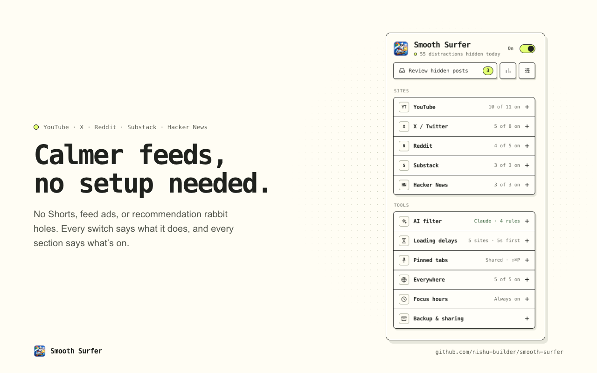
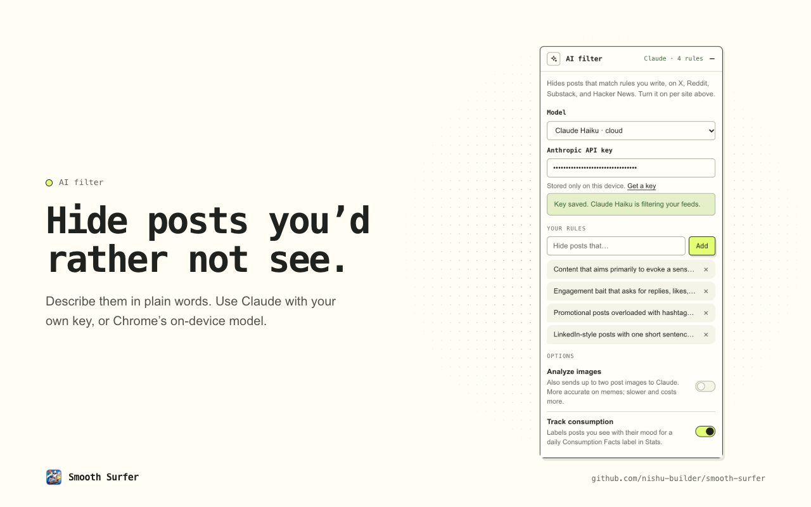
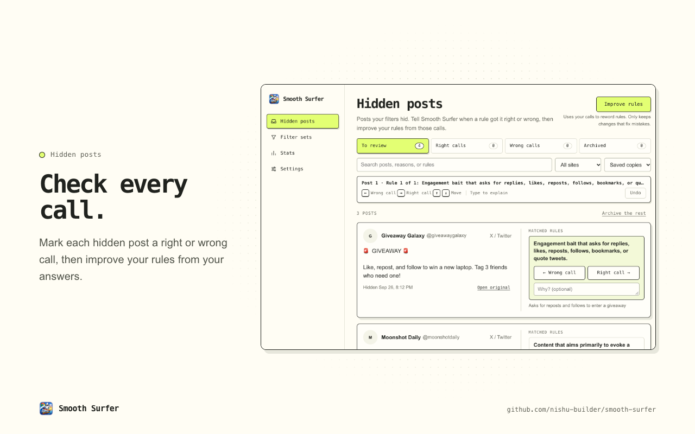
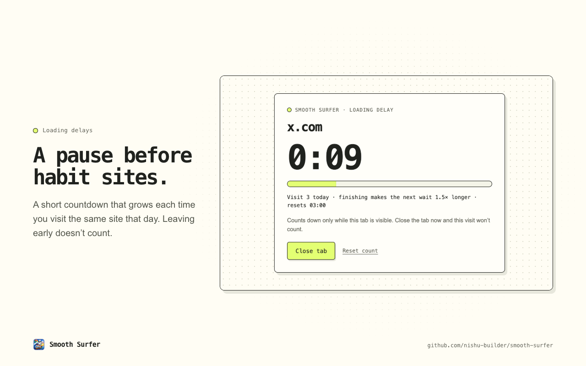
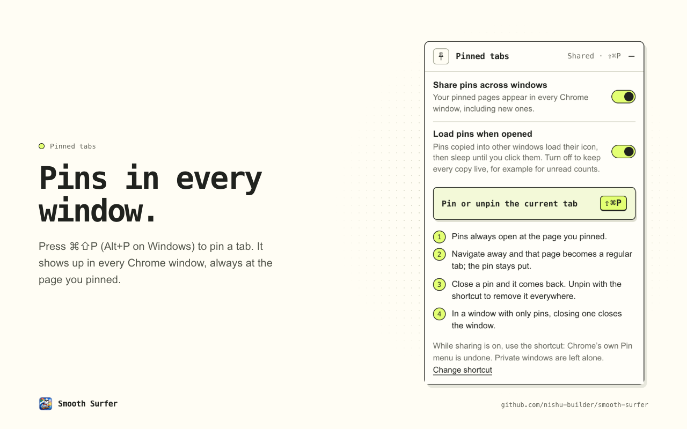
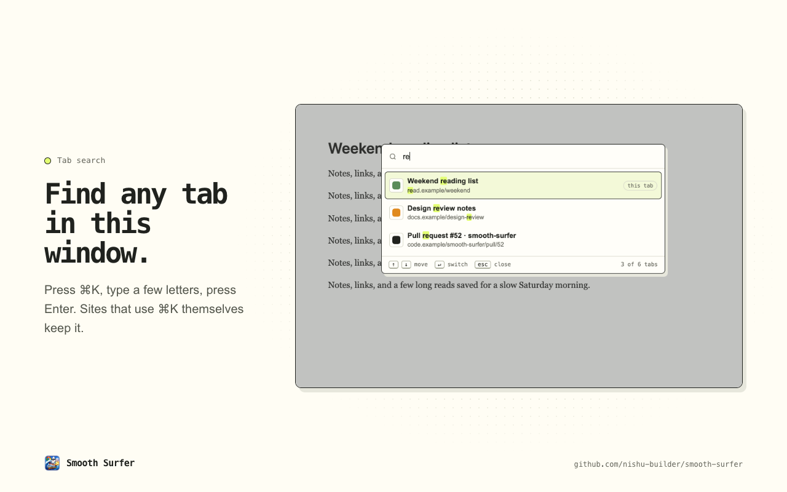

# Smooth Surfer

[](https://github.com/nishu-builder/smooth-surfer/actions/workflows/ci.yml)
[](https://chromewebstore.google.com/detail/smooth-surfer/cgmineplcpnmdfokdblnnapnbpknfghe)

Calmer feeds, a pause before habit sites, and pinned tabs that follow you into
every Chrome window. It works as soon as you install it: no account, no
analytics, and no Smooth Surfer servers.

**[Install from the Chrome Web Store →](https://chromewebstore.google.com/detail/smooth-surfer/cgmineplcpnmdfokdblnnapnbpknfghe)**



## What it does

### Calmer feeds

Cleanup switches for five sites, most on by default. Open the toolbar menu on a
site and its section opens first, with every switch described in one line.

| Site | Switches |
| --- | --- |
| YouTube | Gray thumbnails, hide recommendations, Shorts, games, live chat, end screens, engagement counts, and comments; block Shorts pages; disable autoplay |
| X / Twitter | Remove feed ads; hide reposts, quote posts, video posts, and trends; prefer the Following tab |
| Reddit | Remove feed ads; hide recommendations and comments |
| Substack | Hide recommendations |
| Hacker News | Hide scores |

X, Reddit, Substack, and Hacker News can also use the AI filter below. On X,
posts stay in place while they are checked; matches fade out, and removals above
your reading position keep their space so the page never jumps.

### AI filter



Describe posts you'd rather not see, like “engagement bait” or “posts that stoke
FOMO,” and matching posts are hidden. It starts with four editable rules.

- **Claude Haiku 4.5** (default) runs with your own Anthropic API key. Optional
  **Analyze images** also sends up to two public post images; it is off by
  default and adds cost and latency.
- **Gemini Nano** (experimental) runs on this computer through Chrome's
  built-in model. It handles text only and never falls back to the cloud. See
  [on-device setup and limits](docs/LOCAL_MODELS.md).

If the filter is switched on but can't run yet (no key, or no model), the menu
says so in its header and on each site, with one click to set it up or turn it
off. If a request fails, posts stay visible and retries are spaced out.

On X, the **Less like this** button beside a post opens a rule editor. Write a
rule, or choose **Suggest rules** and edit one before adding it. Suggestions
never change your rules on their own.

### Hidden posts



Every post the filter hid appears in **Hidden posts**, with the rule that matched.
Mark each one a **Right call** or **Wrong call** (← and → on the keyboard),
optionally explaining why, then choose **Improve rules**. Your selected model
proposes rewordings and replays your saved examples. A revision is kept only
if it fixes mistakes without introducing new ones, and the last 30 revisions can
be undone. It is calibration against your examples, not a guarantee; see
[the algorithm](docs/CALIBRATION.md).

<details>
<summary>Inboxes, keyboard, and storage</summary>

- Inboxes: **To review**, **Right calls**, **Wrong calls**, and **Archived**.
  Counts are per rule and post, so a post that matched two rules counts twice.
- Keys: ← Wrong call, → Right call, ↑/↓ move, Cmd/Ctrl+Z undo. Start typing to
  explain the selected call; Enter returns to the keys.
- X posts show as native embeds, with saved copies as a fallback.
- Up to 2,000 hidden and archived posts within 6 MB stay on this device. Hidden
  posts expire after seven days; archived ones don't. **Archive the rest** moves
  everything still to review into Archived. Calls are stored separately (up to
  2,000 within 2 MB), so archiving never erases what you taught the filter.
- Improving rules runs in the background and resumes after Chrome restarts.

</details>

**Filter sets** save named bundles of rules, preview the Quiet browsing and Work
presets, and import or export sets as JSON. Importing adds only what you check,
up to 20 sets per device, and never includes API keys.

### A pause before habit sites



Listed sites open behind a short countdown. It's on for YouTube, X, Reddit,
Substack, and Hacker News by default, and you can add any site from the menu,
including the one you're on.

<details>
<summary>How the countdown grows</summary>

- The first wait is 1 second by default (1–300 seconds). Each wait you finish
  that day makes the next one 1.5× longer, up to 20 minutes. Counts reset at
  03:00 local time.
- The countdown runs only while the tab is visible. Closing the tab early doesn't
  advance the next wait. **Reset count** returns to the first wait.
- A finished tab keeps its pass across reloads, and waits again after 30 minutes
  in the background. `twitter.com` and `x.com` cover each other.
- Stats shows loads, finished waits, early exits, resets, time waited, and visits
  by hour.

</details>

### Pinned tabs in every window



Press **Cmd+Shift+P** (Alt+P on Windows and Linux) to pin or unpin a tab. Pins
appear in every regular Chrome window, including new ones, always at the page
you pinned. Sharing is on by default; turn it off to keep pins per window.

<details>
<summary>How shared pins behave</summary>

- Navigating away from a pin moves that page into a regular tab (keeping its
  history) and restores the pin at its saved URL. Reloading keeps it pinned.
- Closing a pin or a window keeps your pins; a closed pin comes back. In a window
  that holds only pins, closing one (Cmd+W) closes the window instead. Unpinning
  with the shortcut removes a pin everywhere without closing its copies.
- Copies in other windows load once for their title and icon, then sleep until
  you click them, so they use no memory in the meantime. The window you pinned a
  page in keeps it live. Turn off **Load pins when opened** to keep every copy
  live, for example for unread counts.
- While sharing is on, the shortcut is the only way to change pins. Pinning or
  unpinning from Chrome's tab menu is undone. Change the shortcut at
  `chrome://extensions/shortcuts`.
- Drag pins to reorder them; new windows use the last order you arranged.
- Private windows are excluded, and saved URLs stay on this device. Chrome may
  still ask you to press Cmd+W twice to close a pinned tab; extensions can't
  change that.

</details>

### Everywhere



- **Pause deep scrolling:** after about 16 screens of a feed, a surf break waits
  for you to choose Keep going.
- **Gray distracting media:** mutes images and video in feeds. Both of these
  skip work tools like Docs, GitHub, and Slack.
- **Video speed keys:** on any site, hold Alt/Option with → or `]` to speed up,
  ← or `[` to slow down, and `\` to reset. The modifier is configurable, or off
  entirely (brackets only).
- **Focus hours:** run Smooth Surfer only between set times, including overnight
  ranges.
- **Tab search:** press Cmd+K (Ctrl+K) to search this window's tabs by title or
  address, with their icons, then Enter to switch. Sites that use Cmd+K themselves, like GitHub or
  Slack, keep it. It can't open on Chrome's own pages, such as the New Tab page;
  Chrome's Search tabs (Cmd+Shift+A) covers every window.
- **Settings shortcut:** press Cmd+Shift+S (Ctrl+Shift+S) twice to open the menu.
- **Stats** counts what was hidden per site and why. With **Track consumption**
  on, a nutrition-style **Consumption Facts** label breaks down the mood of the
  posts you actually saw today.
- **Backup:** export or import every setting as JSON. Your API key is never
  included.

## Privacy

Settings sync with your Chrome profile; your API key, hidden posts, calls, and
statistics stay on this device. Post content leaves the browser only when you
choose Claude: then feed text (and images, if you turn that on) goes to Anthropic
with your own key. See [PRIVACY.md](PRIVACY.md) for details.

## Install

Most people want the [Chrome Web Store build](https://chromewebstore.google.com/detail/smooth-surfer/cgmineplcpnmdfokdblnnapnbpknfghe),
which updates automatically. A welcome page opens after installing; pin Smooth
Surfer from Chrome's extensions menu to keep it one click away.

To run it from source (for development or an unreleased version):

```sh
git clone git@github.com:nishu-builder/smooth-surfer.git
```

1. Open `chrome://extensions` and turn on **Developer mode**.
2. Click **Load unpacked** and select the `smooth-surfer` folder.
3. After pulling changes, reload the extension there and refresh open tabs.

### iPhone

The repository also builds an iPhone Safari extension. It works on websites in
Safari, not in native apps, and uses Claude for the AI filter, since Chrome's
built-in model isn't available on iOS. It isn't on the App Store; see the
[iPhone build instructions](docs/iphone.md) and [platform scope](docs/PLATFORM_SCOPE.md).

## Development

The extension is plain JavaScript, HTML, and CSS with no runtime dependencies,
so the tests run without installing anything:

```sh
npm run check     # syntax checks, unit tests, and headless Chrome tests
npm ci            # dev tools for the commands below
npm run verify    # ESLint + Prettier check + npm run check
```

The Chrome tests that load the real extension need a build that honors
`--load-extension`. Branded Chrome 137+ doesn't; point `CHROME_BIN` at Chrome
for Testing (CI downloads it automatically on Linux).

- [Product style guide](docs/STYLE_GUIDE.md): the paper-and-ink look, terms,
  and interface principles.
- Store and README graphics: `node scripts/capture-store-assets.mjs` renders
  everything in [docs/store-assets](docs/store-assets) from the real extension.
- [Releasing](docs/RELEASING.md): how a `v*` tag becomes a Chrome Web Store
  release. See the [changelog](CHANGELOG.md) for what changed.
- Planned work is in [TODO.md](TODO.md).
